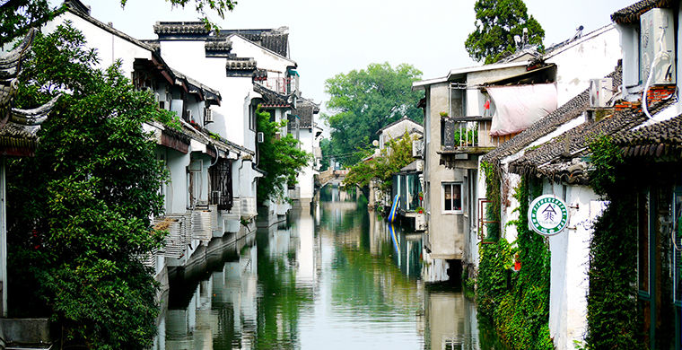
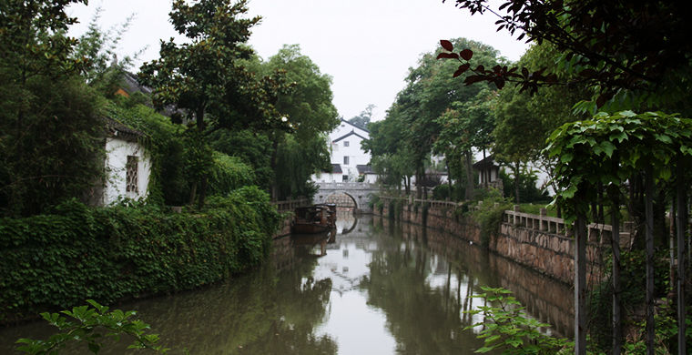
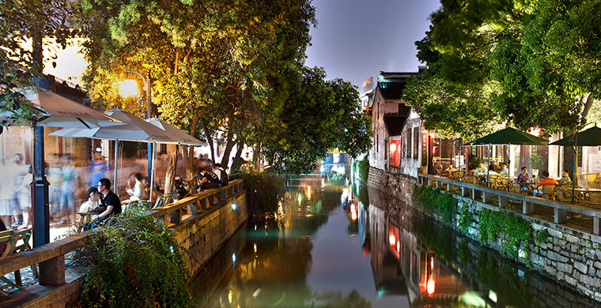
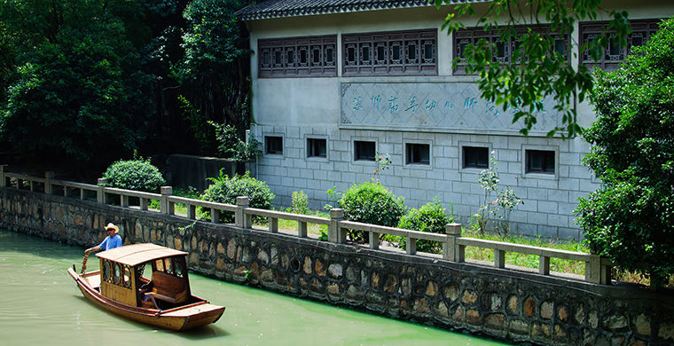
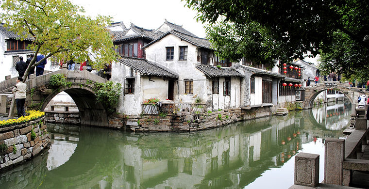
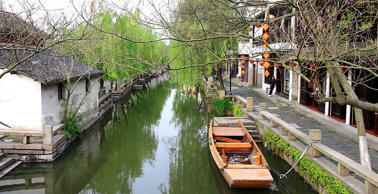
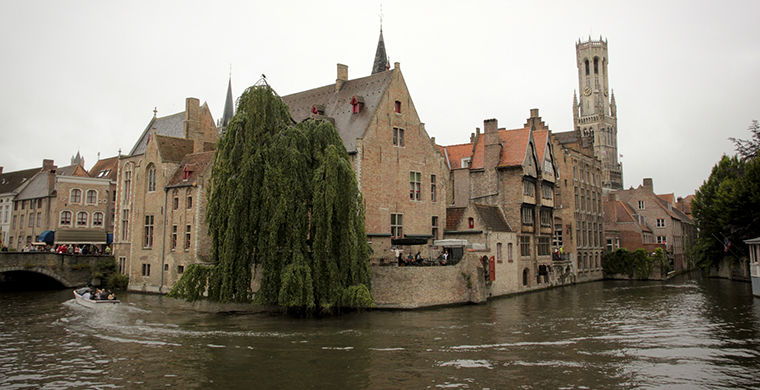
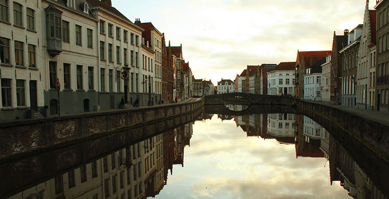
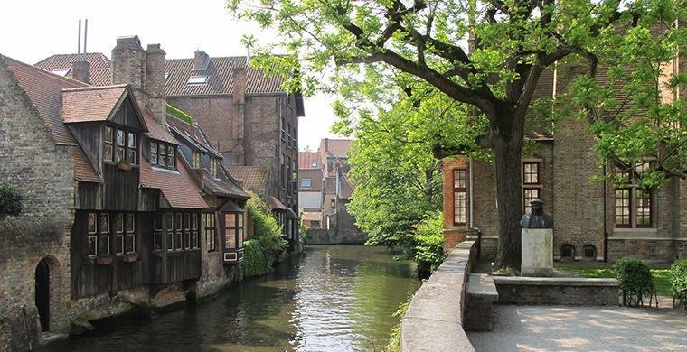

**ГОРОДА НА ВОДЕ**

Еще тысячи лет назад китайские строители возводили поселения, по которым можно было передвигаться только на лодках. В Европе же можно почувствовать колорит Средневековья, прокатившись на катере по каналам древнего города Брюгге.

**Вучжен, Китай**

 
 

Города на воде для Китая не редкость — турагентства предлагают даже целые туры по Восточной Венеции. Только в районе реки Янцзы расположен целый ряд городов на воде. Среди них выделяется Вучжен. Его история уходит корнями в глубокую древность. Ученые подсчитали, что первые поселения появились тут еще 7000 лет назад. Вучжен сохранился лучше всех водных городов Китая, чем и стал интересен туристам. Большая часть города состоит из древней застройки. Местные жители тысячелетиями не меняли свой привычный образ жизни: как и в былые времена, они покупают еду не выходя из дома. Им достаточно выглянуть в окно и выбрать нужный товар у проплывающих мимо торговых лодок.

**Чжоучжуан, Китай**

  

Один из самых древних китайских водных городов расположен в бассейне озера Тайху. Небольшие речки образуют улицы Чжоучжуана. Озеро выполняет роль центральной площади. Этот город очень популярен у китайских туристов, а иностранцы здесь большая редкость, притом что достопримечательностей в Чжоучжуане не меньше, чем в более популярном Вучжене. Например, в городе сохранились древние каменные мосты, белоснежные дома с черной черепицей и красными дверями. В самых древних строениях вместо стекол установлены отполированные прозрачные ракушки. Как и в давние времена, с их помощью жители сохраняют в доме прохладу даже в самый жаркий день. Древнейшим постройкам города более девяти веков. Одна из самых ярких достопримечательностей Чжоучжуана — храм Ченгксу, построенный в XI веке при династии Сонг. Впечатляет не только величественная архитектура Ченгксу, но и длинный каменный мост, который ведет к храму. Под ним можно увидеть великое множество золотых рыбок, которые буквально кишат в воде.

**Брюгге, Бельгия**

  

Брюгге — столица бельгийской провинции Западная Фландрия. Историческая застройка здесь сохранилась так же хорошо, как и в Венеции. В Брюгге можно покататься на лодке по многочисленным каналам, вдоль которых выстроились уютные домики эпохи Средневековья. Через город проходят три крупных канала: Гентский, Слёйсский и Остендский. Их глубина позволяет пропускать даже морские суда. А вот по маленьким каналам, которые образуют небольшие улочки в центральной части города, можно проплыть разве что на небольшой лодке. Всего в городе насчитывается 54 моста, среди которых есть и разводные для пропуска больших судов. Кстати, в XIV веке Брюгге был одним из крупнейших торговых центров Северной Европы. Неслучайно считается, что именно в этом городе в 1406 году была основана первая биржа.
