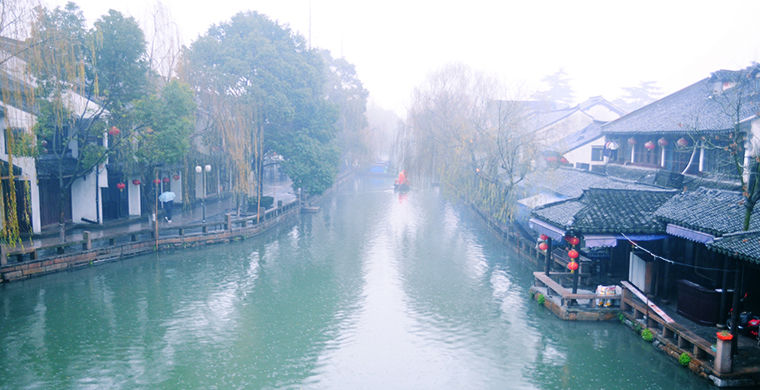

**CITIES ON WATER**

Thousands of years ago, Chinese builders were building settlements that could only be moved by boat. In Europe, you can feel the color of the Middle Ages by taking a boat ride through the canals of the ancient city of Bruges.

**Vuzhen, China**

 
 

Cities on the water are not uncommon for China - travel agencies offer even whole tours of Eastern Venice. Only in the area of the Yangtze River there are a number of cities on the water. Wuzhen stands out among them. Its history goes back to the ancient times. Scientists have estimated that the first settlements appeared here 7000 years ago. Vuzhen is preserved better than all water cities in China, than and became interesting to tourists. Most of the city consists of ancient buildings. Local residents have not changed their usual way of life for thousands of years: as in the old days, they buy food without leaving home. All they need to do is look out the window and choose the right product from the passing trade boats.

**Zhouzhuang, China**

  

One of the oldest Chinese water towns is located in the Taihu Lake basin. Small rivers form the streets of Zhouzhuang. The lake serves as the central square. This city is very popular with Chinese tourists, and foreigners are very rare here, while the attractions in Zhouzhouan is no less than in the more popular Wuzheng. For example, the city has preserved ancient stone bridges, snow-white houses with black tiles and red doors. In the oldest buildings, polished transparent shells are installed instead of glasses. Just as in ancient times, residents use them to keep the house cool even on the hottest day. The oldest buildings in the city are over nine centuries old. One of the brightest sights in Zhouzhouan is the Chengxu Temple, built in the XI century under the Song dynasty. Not only the majestic architecture of Chengxu, but also the long stone bridge that leads to the temple is impressive. Under it, you can see a great number of goldfish, which literally swarm in the water.

**Brugge, Belgium**

  

Bruges is the capital of the Belgian province West Flanders. Its historical building has been preserved here as well as in Venice. You can go for a boat ride in Bruges through numerous channels, along which cozy medieval houses lined up. Three large canals pass through the city: Ghent, Slöjske and Ostend. Their depth allows even seagoing ships to pass through. But the small canals that form small streets in the central part of the city, you can only sail by small boat. In total, the city has 54 bridges, among which there are also swing bridges to pass the large ships. By the way, in the XIV century Bruges was one of the largest shopping centers in Northern Europe. It is no coincidence that it is in this city in 1406 was founded the first exchange.

